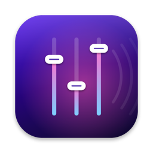

<p align="center"></p>

# Sonora

**Per-app volume control for macOS, right in your menu bar.**

Turn YouTube down while you're on a WhatsApp call, keep Spotify quiet under a Zoom meeting, or mute that one noisy tab without touching the system volume.

```
 ┌─────────────────────────────────────────┐
 │ Output: MacBook Pro Speakers            │
 │ [▶] YouTube (Safari)  ━━━━━○──────  45% │
 │ [✆] WhatsApp          ━━━━━━━━━━○ 100%  │
 │ [♫] Spotify           Muted             │
 ├─────────────────────────────────────────┤
 │ Reset All Levels                        │
 │ ✓ Launch at Login                       │
 │ Quit Sonora                        ⌘Q   │
 └─────────────────────────────────────────┘
```

- One slider per app that is playing audio, from 0% to 150% (boost).
- Click an app's icon to mute it.
- Volumes are remembered per app and re-applied whenever it plays again.
- **During calls**, other apps fade down automatically (by 12 dB by default; a little, a lot, mute, or off), and fade back when the call ends. This stops speaker music from leaking into your microphone: call apps' echo cancellers remove speech well but music poorly. During a call the menu also offers **Filter Music Out of Your Mic…**, which explains how to turn on macOS's *Voice Isolation* mic mode (Control Center → Mic Mode), the strongest mic filter available. macOS doesn't let one app change another app's mic mode, so Sonora can't switch it for you.
- Browser and app helper processes are grouped under the app you know (Chrome, Safari, WhatsApp…).
- No audio driver or kernel extension to install, and no virtual device to pick. It works with whatever output you're using, including AirPods, and follows output changes automatically.
- Apps you leave at 100% are not touched at all.
- The menu bar title "deciphers" into the app name and level whenever you move a slider, then goes back to the plain icon. Menu rows slide in, and playing apps show bouncing activity bars (green during a call). All animation stops if macOS *Reduce Motion* is on.
- Only regular apps are listed. macOS background processes (Siri, dictation, alert sounds) are left alone, except call audio from `avconferenced`, which is shown as **FaceTime** (or **Phone** for iPhone calls when only the Phone app is open).
- If Sonora can't capture audio (System Audio Recording denied), it stops tapping so no app is ever left silent, and the menu shows how to fix it.

## Requirements

- macOS **14.2 Sonoma** or newer (Apple Silicon or Intel)

## Install

### Download

Grab `Sonora.zip` from [Releases](https://github.com/astralisdev/sonora/releases), unzip it and move **Sonora.app** to `/Applications`.
The app is not notarized yet, so the first time **right-click → Open** (or run `xattr -dr com.apple.quarantine /Applications/Sonora.app`).

### Build from source

Requires Go 1.22+ and the Xcode Command Line Tools (`xcode-select --install`).

```sh
git clone https://github.com/astralisdev/sonora.git
cd sonora
make install      # builds Sonora.app, copies it to /Applications and launches it
```

Other targets: `make app` (build only, into `build/`), `make run`, `make test`, `make universal` (arm64 + x86_64), `make zip`.

`make` signs the app with your first *Developer ID* or *Apple Development* certificate if you have one, so macOS remembers the permission below across rebuilds; with no certificate it falls back to an ad-hoc signature, and macOS asks again after every rebuild.

The first time you change an app's volume, macOS asks for permission to capture **system audio**. Allow it (System Settings → Privacy & Security → Screen & System Audio Recording → *System Audio Recording Only*). Sonora needs it to read the app's audio and play it back at the new level. Nothing is recorded or sent anywhere.

Turn on **Launch at Login** from the menu to keep Sonora running.

## How it works

Sonora uses **Core Audio process taps** (`AudioHardwareCreateProcessTap`, added in macOS 14.2).

For every app whose volume is **not** 100%:

1. A private tap is created over all of the app's audio processes. Its mute behaviour is `CATapMutedWhenTapped`, so the app's own sound is silenced only while Sonora is reading the tap.
2. A private aggregate device combines the current output device with that tap.
3. A real-time IOProc copies the tapped audio to the output, multiplied by the app's gain. Gain changes are ramped so they don't click.

When the app goes back to 100%, or has been quiet for a few seconds, the tap is torn down and the app plays directly again. If Sonora quits or crashes, every app goes back to normal immediately, because a muted-when-tapped tap stops muting once nobody reads it.

### Code layout

| File | What it does |
| --- | --- |
| `main.go` | Entry point and CLI flags (`-list`, `-version`) |
| `settings.go` | Per-app settings saved to `~/Library/Application Support/Sonora/settings.json` and exported to the native side |
| `engine.m` | Audio engine: process discovery and grouping, taps, aggregate devices |
| `dsp.c` / `dsp.h` | Real-time signal path: gain ramp and look-ahead limiter (plain C, unit-tested) |
| `dsp.go`, `dsp_test.go` | Go wrapper for the DSP, and tests for transparency, clipping, distortion and smoothness |
| `ui.m` | Menu bar item and slider rows (AppKit) |

The UI and audio layers are Objective-C called through cgo, since AppKit and the real-time Core Audio callback have no pure-Go equivalent. Everything else is Go.

## Known limitations

- **Call apps (WhatsApp, FaceTime, Zoom…)** work, with one twist. macOS raises call audio by a fixed amount (about +20 dB) *after* the point where taps read it. So for an app that is using voice processing, Sonora adds that boost back before applying your volume. Calls are detected from the echo canceller's signature: the app reads its own output device back as an input. The boost was measured on AirPods. If a call sounds too loud or too quiet at 100% on your setup, run `Sonora -calibrate <bundle id>` during a call, pick the step that sounds like "direct", and put that number in `settings.json` as `"callBoostDB"`.
- **Latency:** an app that is not at 100% is heard about 60 ms late. Most of that delay comes from macOS's tap and aggregate-device path, and Sonora keeps its own part small (128-frame buffers, 1.3 ms limiter). You can notice it as a slight lip-sync offset on video calls. At 100%, Sonora steps out of the way within 3 s and there is no added delay.
- Creating or removing a tap can cause a very short glitch in other audio.
- Boosting is limited to +6 dB (150%).
- Output follows the system default device. Routing apps to different devices isn't supported (yet).

## Volume curve and limiter

Below 100% the slider is squared (50% ≈ -12 dB, about half as loud to the ear). Above 100% it boosts evenly in dB, up to +6 dB at 150%. 100% is exactly unity and bypasses Sonora entirely.

Every tapped app goes through a **look-ahead peak limiter** with a -1 dBFS ceiling. Instead of reshaping individual samples, which is what makes boosted audio crackle, it lowers the volume smoothly about 1.3 ms *before* a peak arrives, then recovers over about 80 ms. Left and right share one gain, so the stereo image never shifts. Gain changes from the sliders are ramped to avoid clicks.

## Debugging

```sh
./build/Sonora.app/Contents/MacOS/Sonora -list          # audio apps; PLAYING / CALL / idle
./build/Sonora.app/Contents/MacOS/Sonora -calibrate net.whatsapp.WhatsApp   # tune callBoostDB during a call
SONORA_DEBUG=1 ./build/Sonora.app/Contents/MacOS/Sonora  # logs taps, gains, levels and dropouts
./build/Sonora.app/Contents/MacOS/Sonora -snapshot rows.png   # renders a menu row for every audio process
SONORA_SIMULATE_NO_PERMISSION=1 ./build/Sonora.app/Contents/MacOS/Sonora  # exercises the permission watchdog
```

## Roadmap

- Per-app output device routing
- Global keyboard shortcuts
- Signed and notarized releases, Homebrew cask
- Optional Control Center / WidgetKit controls

Contributions are welcome. Open an issue or a PR.

## License

[MIT](LICENSE)
